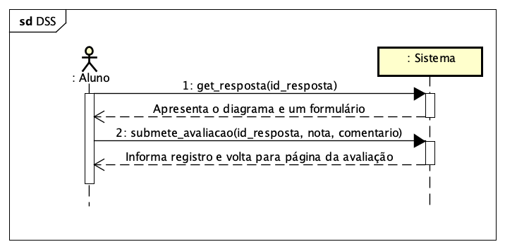

# CDU011. Avaliar trabalho de colega 

- **Ator principal**: Aluno (avaliador)
- **Atores secundários**: (nenhum)
- **Resumo**: Na página de uma avaiação específica, o aluno (logado) clica no link que solicitou que ele avaliasse o diagrama de um colega. É apresentada a resposta do colega e um formulário para atribuir uma nota e um comentário (opcional).
- **Pré-condição**: 
  - aluno (avaliador) logado no sistema;
  - trabalhos enviados corretamente na janela de submissão;
  - jenala de correção aberta pelo professor.
- **Pós-Condição**: 
  - correção do trabalho submetida e persitida. 

## Fluxo Principal
| Ações do ator | Ações do sistema |
| :-----------: | :--------------: | 
| 0 - Aluno é convidado a avaliar o trabalho de um colega e clicar em um link | |  
| 1 - Aluno clica no link para avaliar trabalho |  |
|  | 2 - Sistema exibe o diagrama a ser avaliado e um formulário contendo nota e comentário |
| 3 - Avaliador preenche o formulário e submete a avaliação |  |
|  | 4 - Sistema informa que a avaliação foi regispersistida com sucesso ao retornar para a página da avaliação específica |

## Fluxo Alternativo I - Avaliador não informa a nota
| Ações do ator | Ações do sistema |
| :-----------: |:---------------: | 
|  | 4.1 - Sistema informa que a nota é inválida e exibe novamente a tela de submissão de correção (retorna ao passo 2 do fluxo principal) |

## Fluxo Alternativo II - Avaliador informa nota negativa ou maior que 100
| Ações do ator | Ações do sistema |
| :-----------: | :--------------: | 
| | 4.2 - Sistema informa que a nota precisar estar entre 0 e 100 e exibe novamente a tela de submissão de correção (retorna ao passo 2 do fluxo principal)  |  

## Diagrama de Interação (Sequência)

### DSS

### Sequência - Etapa 1

### Sequência - Etapa 2

## Diagrama de Classes de Projeto

> Substituir pela imagem contendo as classes (modelo, visão e templates) que implementam o respectivo CDU...